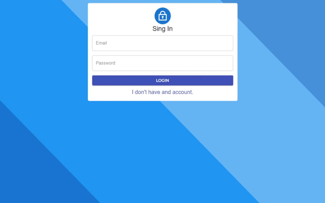

# An todo app

<h2 align="center">
    
 

</h2>

<h2>Features:</h2>

<ul>
    <li>Single page application</li>
    <li>Fully Responsive</li>
    <li>Minimalist</li>
<ul>

<h2>Technologies used:</h2>

<ul>
    <li>React</li>
    <li>TypeScript</li> 
    <li>Material UI</li>
    <li>Firebase</li>
<ul>

<h2>See live demo, <a target="_blank" href="https://kyonyx12.github.io/todo-app/#/">Click here</a>.</h2>

